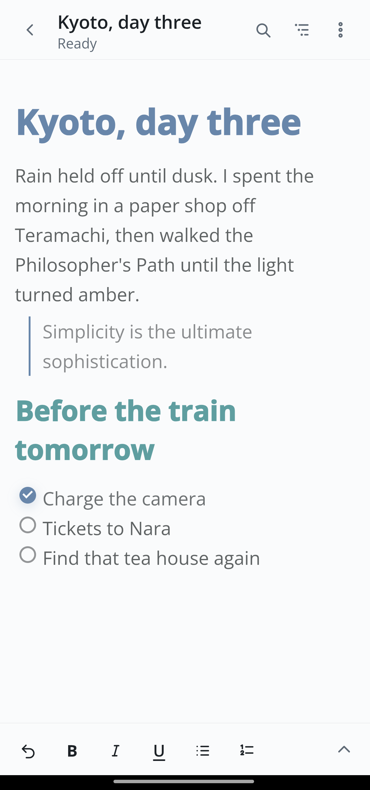
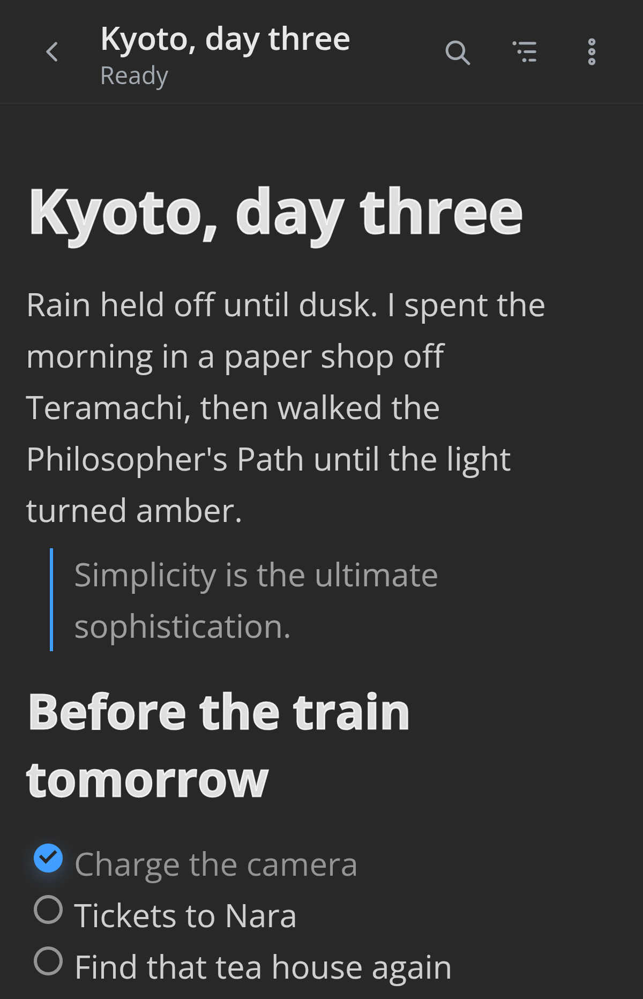
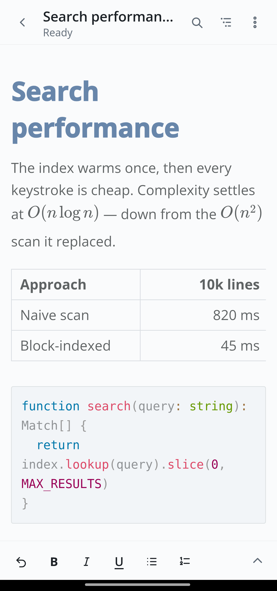
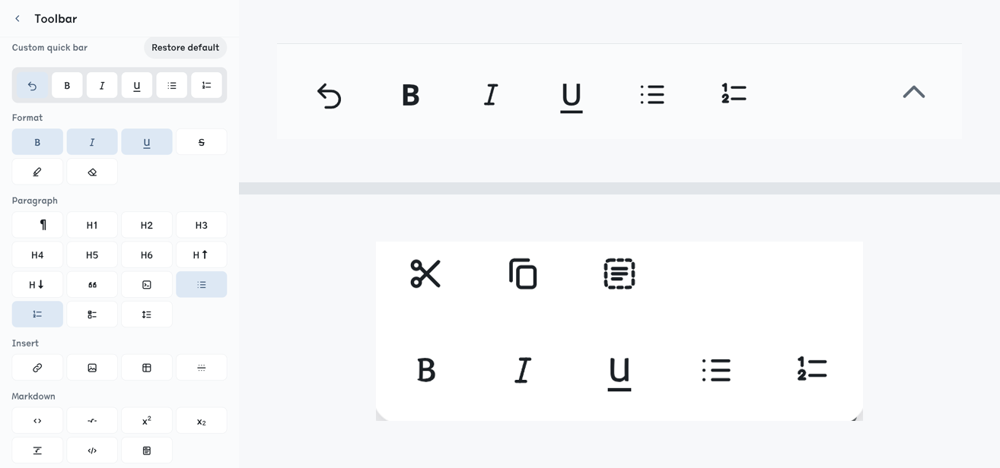
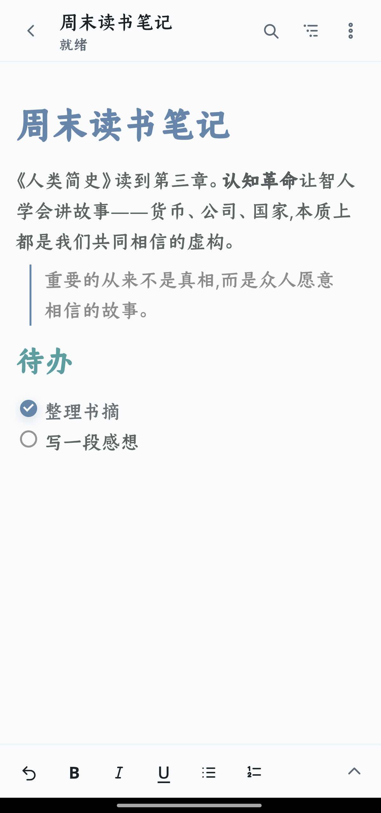

<p align="center">
  
</p>

<h1 align="center">MarkText for Android</h1>

<p align="center">
  A quiet, focused Markdown editor for Android —<br>
  the desktop <a href="https://github.com/marktext/marktext">MarkText</a> writing experience, shaped for the phone.
</p>

<p align="center">
  
  
  
</p>

<p align="center">
  <a href="#highlights">Highlights</a> ·
  <a href="#build-from-source">Build from source</a> ·
  <a href="#license--attribution">License</a>
</p>

<p align="center">
  
  &emsp;&emsp;&emsp;&emsp;&emsp;&emsp;&emsp;&emsp;&emsp;&emsp;
  
</p>

> **Unofficial community port.** Not affiliated with, endorsed by, or maintained
> by the MarkText team. It builds on and modifies MarkText's open-source editor
> core (Muya) for Android — see [License & attribution](#license--attribution).

## What it is

MarkText for Android brings MarkText's live-preview Markdown editing to a phone
without a native rewrite. Its editing core began as Muya — MarkText's open-source
engine — but is substantially reworked here: rebuilt for smooth performance on
large documents, re-laid-out to reclaim phone width, and extended with mobile
selection and toolbar behavior that never existed on desktop. What you write still
renders with the fidelity you expect from MarkText, in an interface shaped for
writing on the go.

The goal is simple: open a `.md` file, edit it, and never lose a word.

## Highlights

### A lightweight Markdown editor that never loses a word

<table width="100%">
<tr>
<td valign="middle">

- True live-preview (WYSIWYG) editing — the desktop MarkText writing experience,
  not a plain text box.
- CommonMark and GitHub Flavored Markdown, with math (KaTeX), diagrams, front
  matter, footnotes, tables, and syntax-highlighted code blocks.
- Document outline and in-document search, tuned to stay smooth in large files.
- Export to **PDF** and share straight to any Android app.
- **Atomic, all-or-nothing saves**, with autosave and recovery drafts — an
  interrupted or failed write never leaves a half-written or corrupted document,
  and drafts are kept, not silently evicted.
- **Fully on-device:** no account, no cloud sync, no telemetry, and your document
  text is never written to logs.
- **Lightweight:** a focused Vue + Capacitor web shell, not a heavy native stack —
  the debug build is around 9.6 MB, a fraction of what many commercial Markdown
  apps ship, and a shrunk release build is smaller still.

</td>
<td width="220" valign="top"></td>
</tr>
</table>

### Make it yours

<table width="100%">
<tr>
<td width="220" valign="middle"></td>
<td valign="middle">

Customization is a first-class feature, not an afterthought — right down to the
bars you touch while writing:

- **Build your own toolbars.** Compose the bottom quick bar from a command pool
  and drag to reorder it. Even the floating selection toolbar — the clipboard bar
  that pops up over selected text — can carry your own extra commands, in one or
  two rows.
- **Toolbar behavior.** Docked, hidden, or compact; choose the default panel and
  whether the app remembers your last one.
- **Themes and type.** Light, dark, and custom themes (`ayu-light`, `one-dark`);
  adjustable font family, size, line height, line width, and text direction (LTR
  or RTL).
- **Markdown to your taste.** List markers and indentation, heading style, front
  matter format (YAML/TOML/JSON), footnotes, super/subscript, HTML rendering, and
  GitLab compatibility.
- **File-level control.** Per-document encoding, line endings, and trailing
  newline handling.

</td>
</tr>
</table>

### Built for the phone, polished for everyone

<table width="100%">
<tr>
<td width="220" valign="top"></td>
<td valign="middle">

- Open and save real files through Android's Storage Access Framework.
- Handle incoming **open** and **share** intents from other apps.
- Comfortable one-handed touch targets and a calm, editor-first layout.
- Wide tables scroll within their own frame instead of shifting the whole page.
- Restrained graphite design with WCAG 2.2 AA contrast, visible focus order, and
  respect for reduced-motion.
- **Ten languages** with automatic system-language selection: English, German,
  Spanish, French, Japanese, Korean, Portuguese, Turkish, and Simplified and
  Traditional Chinese.

</td>
</tr>
</table>

## Project status

This is a mature debug/beta build, **not yet a signed public release**. The
editor and its document-safety workflows are stable and well-tested, but the
release pipeline (app signing, published builds, and on-device release
verification) is still being finalized. Until then, the way to try it is to build
from source.

Signed builds will be published on the
[Releases](https://github.com/Renakoni/marktext-android/releases) page when ready.

## Build from source

You'll need [Node.js](https://nodejs.org/) with [pnpm](https://pnpm.io/) and
[Android Studio](https://developer.android.com/studio) (Android SDK — min API 24,
target 36 — and a JDK).

```sh
pnpm install          # install dependencies
pnpm dev              # preview the web shell in a browser
pnpm android:sync     # build the web app and sync it into the Android project
pnpm android:open     # open it in Android Studio, then run on a device or emulator
```

Other scripts (`test`, `lint`, `typecheck`, `build`) are in `package.json`.

One thing that isn't obvious: the Markdown editor core is a vendored, modified copy
of `@muyajs/core` (Muya) under `third_party/muya`. If you change it, sync your edits
into `node_modules/@muyajs/core/src/**` before building — a contract test catches drift.

## Tech stack

- [Vue 3](https://vuejs.org/) + [Vite](https://vite.dev/) for the web shell.
- [Capacitor](https://capacitorjs.com/) for the Android project and native bridge.
- A modified [`@muyajs/core`](https://github.com/marktext/muya) (Muya) as the
  Markdown editor core.

## Contributing

Issues and pull requests are welcome. Please keep each change focused and
coherent, include tests where it makes sense, and make sure `pnpm test`,
`pnpm lint`, and `pnpm typecheck` pass before opening a PR.

## License & attribution

MarkText for Android is released under the [MIT License](LICENSE).

This is an **unofficial** Android port. It builds on MarkText's open-source work
and is not affiliated with or endorsed by the MarkText project:

- **MarkText** — the desktop editor and design lineage this port follows.
  Copyright © Luo Ran and MarkText contributors. MIT licensed.
- **Muya** (`@muyajs/core`) — the Markdown editor core this project's editor is
  derived from and modifies, vendored under `third_party/muya` with its original
  MIT license retained
  ([`third_party/muya/LICENSE`](third_party/muya/LICENSE)).

## Acknowledgements

- [MarkText](https://github.com/marktext/marktext) and its
  [contributors](https://github.com/marktext/marktext/graphs/contributors) for
  the editor and the design it inherits.
- [Muya](https://github.com/marktext/muya) for the Markdown editing engine.
- [Vue](https://vuejs.org/), [Vite](https://vite.dev/), and
  [Capacitor](https://capacitorjs.com/) for the app foundation.
