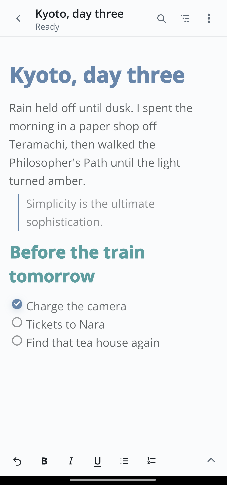
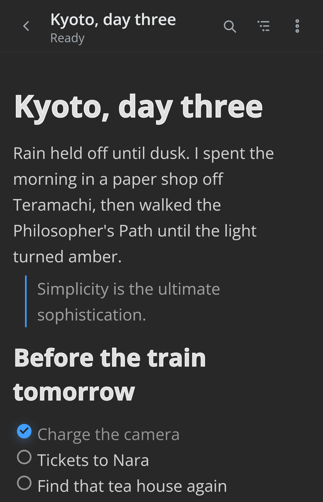
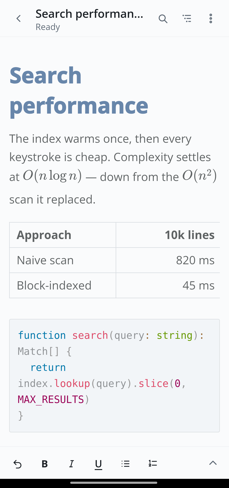
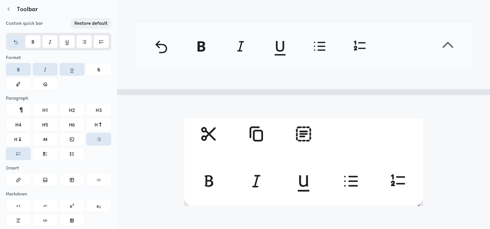
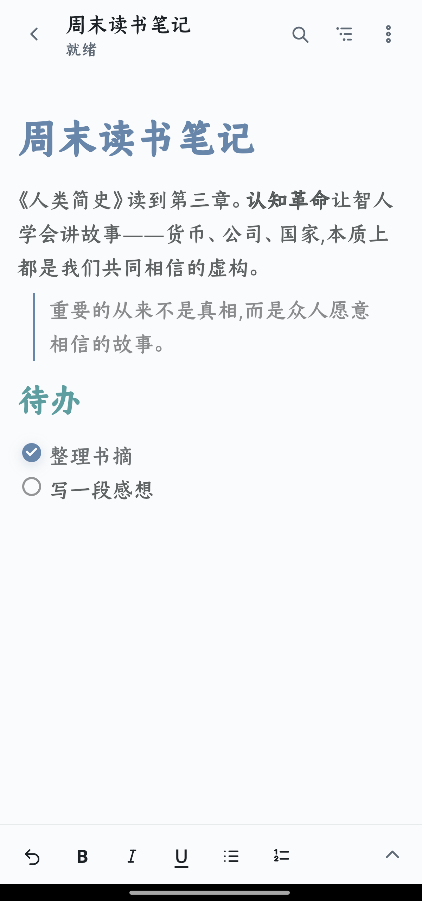

<p align="center">
  
</p>

<h1 align="center">MarkText for Android</h1>

<p align="center">
  <sub>
    🌐&nbsp;
    <a href="README.md">English</a>
    &nbsp;·&nbsp; <a href="README.zh-CN.md">简体中文</a>
    &nbsp;·&nbsp; <a href="README.zh-TW.md">繁體中文</a>
    &nbsp;·&nbsp; <a href="README.de.md">Deutsch</a>
    &nbsp;·&nbsp; <a href="README.es.md">Español</a>
    &nbsp;·&nbsp; <a href="README.fr.md">Français</a>
    &nbsp;·&nbsp; <a href="README.ja.md">日本語</a>
    &nbsp;·&nbsp; <a href="README.ko.md">한국어</a>
    &nbsp;·&nbsp; <b>Português</b>
    &nbsp;·&nbsp; <a href="README.tr.md">Türkçe</a>
  </sub>
</p>

<p align="center">
  <em>Markdown, em silêncio.</em>
</p>

<p align="center">
  <sub>Um editor focado para Android — a experiência do <a href="https://github.com/marktext/marktext">MarkText</a> de desktop, moldada para o celular.</sub>
</p>

<p align="center">
  
  &nbsp;
  
  &nbsp;
  <a href="https://github.com/Renakoni/marktext-android/releases/latest"></a>
</p>

<p align="center">
  <a href="#destaques">Destaques</a> ·
  <a href="#compile-a-partir-do-código-fonte">Compile a partir do código-fonte</a> ·
  <a href="#licença-e-atribuição">Licença</a>
</p>

<p align="center">
  
  &emsp;&emsp;&emsp;&emsp;&emsp;&emsp;&emsp;&emsp;&emsp;&emsp;
  
</p>

<p align="center">
  <sub>☀&nbsp; Claro &nbsp;·&nbsp; Escuro &nbsp;☾&nbsp; — o que o seu sistema preferir</sub>
</p>

> [!NOTE]
> **Port comunitário não oficial** — sem afiliação, endosso ou manutenção
> por parte da equipe do MarkText. Ele se baseia no núcleo de editor de código
> aberto do MarkText (Muya) e o modifica para Android; consulte
> [Licença e atribuição](#licença-e-atribuição).

## O que é

O MarkText for Android traz a edição de Markdown com visualização ao vivo do
MarkText para o celular, sem reescrevê-lo como aplicativo nativo. Seu editor é o
Muya, o núcleo de código aberto do MarkText, profundamente adaptado para o
celular: mais rápido em documentos grandes, com layout reorganizado para a
largura de um telefone e equipado com a seleção por toque e as barras de
ferramentas de que um desktop nunca precisou. O que você escreve é renderizado
com a mesma fidelidade do desktop, em uma interface feita para uma mão só.

## Destaques

### Um editor Markdown leve que nunca perde uma palavra

<table width="100%">
<tr>
<td valign="middle">

- Edição com visualização ao vivo de verdade (WYSIWYG) — a experiência de escrita
  do MarkText de desktop, não uma simples caixa de texto.
- CommonMark e GitHub Flavored Markdown completos: matemática (KaTeX), tabelas,
  notas de rodapé, front matter, diagramas e código com realce de sintaxe.
- Uma estrutura do documento e uma pesquisa no editor que continuam fluidas mesmo
  em arquivos longos.
- Exportação para **PDF** com matemática, realce de código e fontes já
  incorporados.
- **Nunca perde o seu trabalho.** O salvamento automático e os rascunhos de
  recuperação preservam cada alteração, e gravações atômicas, de tudo ou nada,
  garantem que um salvamento interrompido nunca deixe um arquivo pela metade ou
  corrompido.
- **Privado por padrão.** Sem conta, sem nuvem, sem telemetria; tudo fica no
  dispositivo.
- **Leve.** Um shell enxuto de Vue + Capacitor, em vez de uma pilha nativa pesada,
  mantém o aplicativo inteiro em cerca de 7,8 MB — pequeno e leve, porém completo
  em recursos.

</td>
<td width="220" valign="top"></td>
</tr>
</table>

### Deixe do seu jeito

<table width="100%">
<tr>
<td width="220" valign="middle"></td>
<td valign="middle">

Aqui a personalização vai fundo, até as barras que você toca enquanto escreve:

- **Monte suas próprias barras de ferramentas.** Componha a barra rápida inferior
  a partir de um conjunto de comandos e arraste para reordená-la. Até a barra de
  seleção — a barra da área de transferência que aparece sobre o texto
  destacado — pode receber seus próprios comandos, em uma ou duas linhas.
- **Temas e tipografia.** Temas claro, escuro e personalizados (`ayu-light`,
  `one-dark`); família de fonte, tamanho, altura da linha, largura da linha e
  direção do texto (LTR ou RTL) ajustáveis.
- **Markdown ao seu gosto.** Marcadores e indentação de listas, estilo de
  cabeçalho, formato de front matter (YAML/TOML/JSON), notas de rodapé,
  sobrescrito/subscrito, renderização de HTML e compatibilidade com GitLab.
- **Controle no nível do arquivo.** Codificação, terminações de linha e
  tratamento da nova linha final por documento.

</td>
</tr>
</table>

### Feito para o celular, polido para todos

<table width="100%">
<tr>
<td width="220" valign="top"></td>
<td valign="middle">

- **Seus arquivos ficam onde estão.** Edite `.md` diretamente de qualquer
  provedor de armazenamento pelo seletor do sistema e troque documentos com
  outros aplicativos pelo menu de compartilhamento — sem o vaivém de
  importar/exportar, sem uma segunda cópia em um sandbox.
- **Feito para o polegar.** Alcance confortável com uma mão e um layout calmo,
  com o editor em primeiro lugar, além de tabelas largas que rolam sozinhas em
  vez de deslocar a página.
- **Acessível e contido.** Um design grafite discreto que atende à WCAG 2.2 AA,
  com ordem de foco visível e respeito à preferência por movimento reduzido.
- **Dez idiomas,** escolhidos automaticamente a partir do seu sistema: inglês,
  alemão, espanhol, francês, japonês, coreano, português, turco e chinês
  simplificado e tradicional.

</td>
</tr>
</table>

---

## Status do projeto

> [!IMPORTANT]
> A primeira versão pública assinada, **v0.1.0**, está disponível. Seu APK é
> compilado pelo fluxo de release do repositório, atrelado ao certificado oficial
> de release, e passou por verificações de instalação limpa e de atualização com
> a mesma chave no Android 14.

Baixe as compilações assinadas na página de
[Releases](https://github.com/Renakoni/marktext-android/releases/latest).

## Compile a partir do código-fonte

Você vai precisar do [Node.js](https://nodejs.org/) com [pnpm](https://pnpm.io/) e
do [Android Studio](https://developer.android.com/studio) (Android SDK — API
mínima 24, alvo 36 — e um JDK).

```sh
pnpm install          # instala as dependências
pnpm dev              # visualiza o shell web em um navegador
pnpm android:sync     # compila o app web e o sincroniza com o projeto Android
pnpm android:open     # abre no Android Studio; depois execute em um dispositivo ou emulador
```

Outros scripts (`test`, `lint`, `typecheck`, `build`) estão no `package.json`.
Mantenedores de release devem seguir o [`docs/RELEASING.md`](docs/RELEASING.md).

> [!TIP]
> O núcleo do editor Markdown é uma cópia **modificada** do `@muyajs/core` (Muya),
> incorporada ao repositório (vendored) em `third_party/muya`. Se você o alterar,
> sincronize suas edições em `node_modules/@muyajs/core/src/**` antes de
> compilar — um teste de contrato detecta divergências.

## Como contribuir

Issues e pull requests são bem-vindos. Mantenha cada mudança focada e adicione
testes onde fizerem sentido.

## Licença e atribuição

O MarkText for Android é distribuído sob a [Licença MIT](LICENSE).

É um port **não oficial**, construído sobre o trabalho de código aberto do
MarkText e sem afiliação ou endosso do projeto MarkText:

- **MarkText** — o editor de desktop e o design que este port segue. Copyright ©
  Luo Ran e os colaboradores do MarkText, sob licença MIT.
- **Muya** (`@muyajs/core`) — o núcleo do editor, incorporado e modificado em
  `third_party/muya`, com sua licença MIT original mantida
  ([`third_party/muya/LICENSE`](third_party/muya/LICENSE)).

## Agradecimentos

O MarkText for Android se apoia em muito trabalho de código aberto: o editor
[MarkText](https://github.com/marktext/marktext) e seus
[colaboradores](https://github.com/marktext/marktext/graphs/contributors), o
mecanismo de edição [Muya](https://github.com/marktext/muya) e o
[Vue](https://vuejs.org/), o [Vite](https://vite.dev/) e o
[Capacitor](https://capacitorjs.com/). Obrigado a todos que os construíram.

---

<p align="center"><sub><em>Markdown, em silêncio.</em></sub></p>
