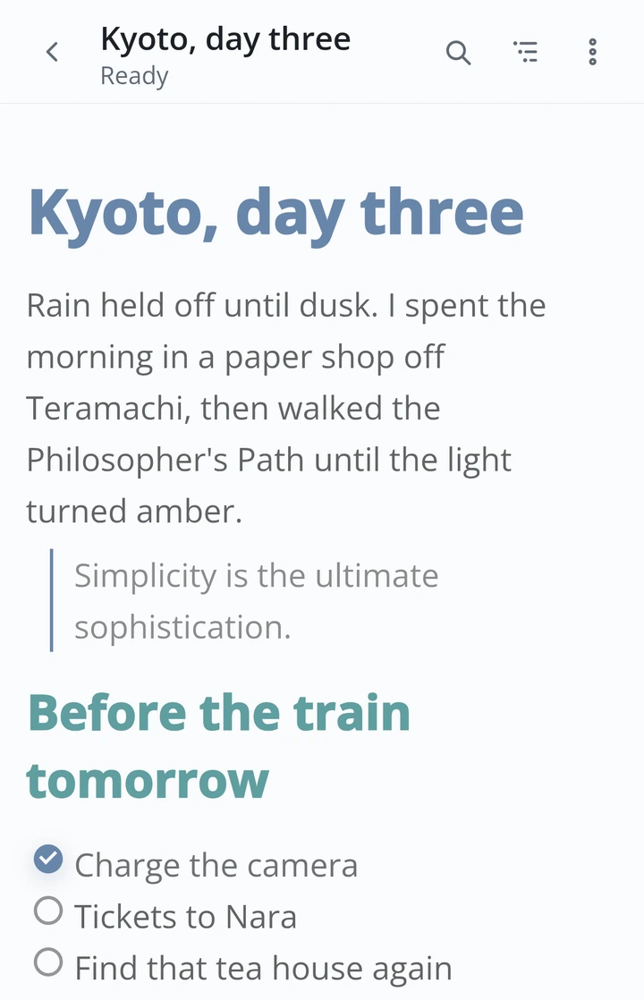
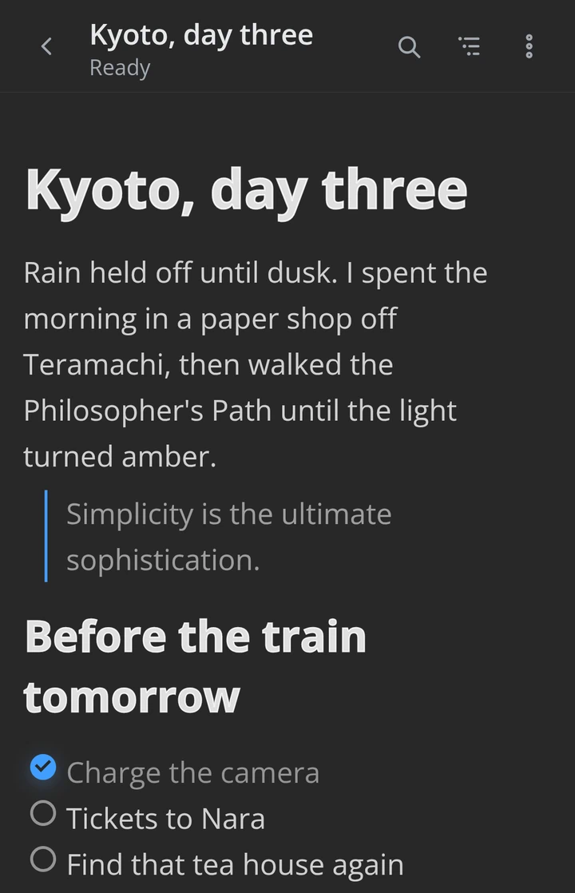
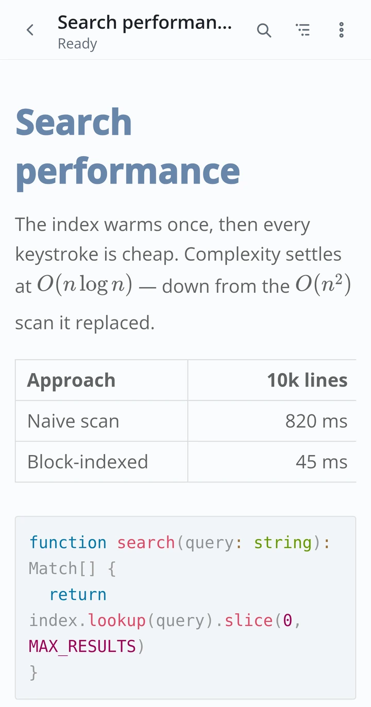
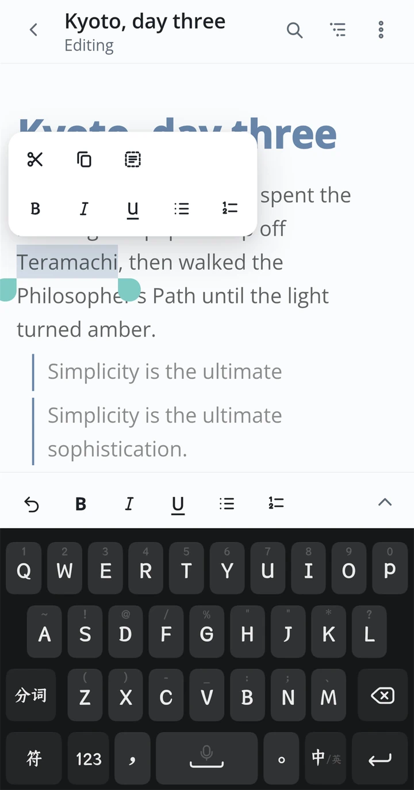
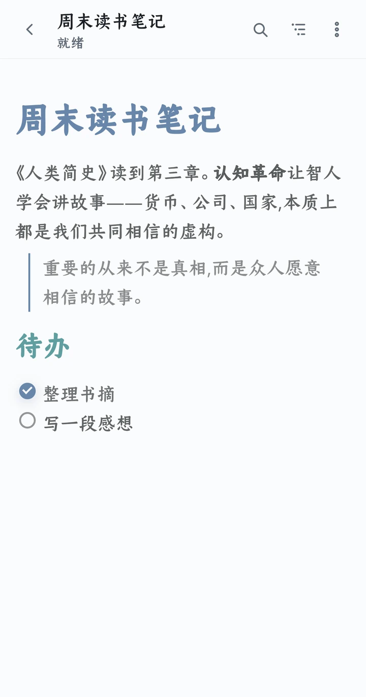

<p align="center">
  
</p>

<h1 align="center">MarkText for Android</h1>

<p align="center">
  <sub>
    🌐&nbsp;
    <a href="../../README.md">English</a>
    &nbsp;·&nbsp; <b>简体中文</b>
    &nbsp;·&nbsp; <a href="README.zh-TW.md">繁體中文</a>
    &nbsp;·&nbsp; <a href="README.de.md">Deutsch</a>
    &nbsp;·&nbsp; <a href="README.es.md">Español</a>
    &nbsp;·&nbsp; <a href="README.fr.md">Français</a>
    &nbsp;·&nbsp; <a href="README.ja.md">日本語</a>
    &nbsp;·&nbsp; <a href="README.ko.md">한국어</a>
    &nbsp;·&nbsp; <a href="README.pt.md">Português</a>
    &nbsp;·&nbsp; <a href="README.tr.md">Türkçe</a>
  </sub>
</p>

<p align="center">
  <em>安静、随心的 Markdown。</em>
</p>

<p align="center">
  <sub>一款精简的 Android Markdown 编辑器。</sub>
</p>

<p align="center">
  
  &nbsp;
  
  &nbsp;
  <a href="https://github.com/Renakoni/marktext-android/releases/latest"></a>
</p>

<p align="center">
  <a href="#亮点">亮点</a> ·
  <a href="#从源码构建">从源码构建</a> ·
  <a href="#许可证与署名">许可证</a>
</p>

<p align="center">
  
  &emsp;&emsp;&emsp;&emsp;&emsp;&emsp;&emsp;&emsp;&emsp;&emsp;
  
</p>

<p align="center">
  <sub>☀&nbsp; 浅色 &nbsp;·&nbsp; 深色 &nbsp;☾&nbsp; —— 跟随系统的偏好</sub>
</p>

> [!NOTE]
> **非官方社区移植版** —— 与 MarkText 团队没有隶属关系，未获其认可，也不由其
> 维护。它基于 MarkText 的开源编辑器核心（Muya）并加以修改，使其运行于
> Android；详见[许可证与署名](#许可证与署名)。

## 它是什么

MarkText for Android 把 MarkText 的实时预览 Markdown 编辑带到了手机上。
它的编辑器是 Muya —— MarkText 的开源核心，并为移动端做了深度适配：
大文档更快、按手机宽度重新排版，还补上了触摸选择与工具栏。你写下的内容
以与桌面端相同的保真度渲染，呈现在一个为单手打造的界面里。

## 亮点

### 轻量的 Markdown 编辑器，一字不丢

<table width="100%">
<tr>
<td valign="middle">

- 真正的实时预览（所见即所得）编辑。

- 完整支持 CommonMark 与 GitHub Flavored Markdown：公式（KaTeX）、表格、
  脚注、前置元数据、图表，以及带语法高亮的代码。

- 文档大纲与编辑器内搜索，在长文件中依然流畅。

- 导出 **PDF**，公式、代码高亮与字体全部内嵌。

- **绝不丢失你的内容**。自动保存、恢复草稿与原子化写入，留住每一次修改。

- **默认私密**。无账号、无云端、无遥测；一切都留在设备上。

- **轻量**。Vue + Capacitor 外壳让整个应用仅约 7.8 MB —— 小巧轻盈，
  功能却一应俱全。

</td>
<td width="220" valign="top"></td>
</tr>
</table>

### 随心定制

<table width="100%">
<tr>
<td width="220" valign="middle"></td>
<td valign="middle">

- **打造你自己的工具栏**。从命令池中自由组合底部快捷栏，并拖动排序。
  就连选择工具栏也能装入你自己的命令。

<br>

- **主题与外观**。浅色、深色与 30+ 款自定义主题，外观细节随你调整。

<br>

- **合你口味的 Markdown**。从列表标记到前置元数据，书写与渲染方式都可细调。

<br>

- **文件级控制**。逐文档设置编码、换行符与末尾换行处理。

</td>
</tr>
</table>

### 为手机而生，为每个人打磨

<table width="100%">
<tr>
<td width="220" valign="top"></td>
<td valign="middle">

- **你的文件留在原地**。通过系统选择器直接编辑任意存储提供方中的 `.md`
  文件，并借助分享面板与其他应用互传文档。

<br>

- **为拇指而设计**。舒适的单手可及范围，沉静、以编辑器为先的布局。

<br>

- **无障碍且克制**。安静的石墨色设计符合 WCAG 2.2 AA，焦点顺序清晰，
  动效轻而不扰。

<br>

- **十种语言，**根据你的系统自动选择：英语、德语、西班牙语、法语、日语、
  韩语、葡萄牙语、土耳其语，以及简体中文与繁体中文。

</td>
</tr>
</table>

---

## 项目状态

> [!IMPORTANT]
> 首个已签名的公开发布版本 **v0.1.0** 现已可用。其 APK 由仓库的发布工作流
> 构建，固定使用官方发布证书，并已在 Android 14 上通过全新安装与同密钥
> 升级检查。

已签名的构建可在
[Releases](https://github.com/Renakoni/marktext-android/releases/latest) 页面下载。

## 从源码构建

你需要 [Node.js](https://nodejs.org/) 与 [pnpm](https://pnpm.io/)，以及
[Android Studio](https://developer.android.com/studio)（Android SDK 与 JDK；
应用最低支持 API 24，面向 API 36 构建）。

```sh
pnpm install          # 安装依赖
pnpm dev              # 在浏览器中预览 Web 外壳
pnpm android:sync     # 构建 Web 应用并同步到 Android 工程
pnpm android:open     # 在 Android Studio 中打开，然后在设备或模拟器上运行
```

其他脚本（`test`、`lint`、`typecheck`、`build`）见 `package.json`。
发布维护者请遵循 [`docs/RELEASING.md`](../RELEASING.md)。

> [!TIP]
> Markdown 编辑器核心是 `@muyajs/core`（Muya）的一份内置且经过**修改**的副本，
> 位于 `third_party/muya`。如果你改动了它，请在构建前把修改同步到
> `node_modules/@muyajs/core/src/**` —— 有契约测试会捕获两者的偏差。

## 参与贡献

欢迎提交 issue 与 pull request。每次改动只做一件事，并在合适的地方补充测试。

## 许可证与署名

MarkText for Android 基于 [MIT 许可证](../../LICENSE)发布。

这是一个**非官方**移植版，构建于 MarkText 的开源成果之上，与 MarkText 项目
没有隶属关系，也未获其认可：

- **MarkText** —— 本移植版所遵循的桌面编辑器与设计。版权所有 © Luo Ran
  及 MarkText 贡献者，MIT 许可。
- **Muya**（`@muyajs/core`）—— 编辑器核心，以内置形式收录并修改于
  `third_party/muya`，其原始 MIT 许可证得以保留
  （[`third_party/muya/LICENSE`](../../third_party/muya/LICENSE)）。

## 致谢

MarkText for Android 站在大量开源工作的肩膀上：
[MarkText](https://github.com/marktext/marktext) 编辑器及其
[贡献者](https://github.com/marktext/marktext/graphs/contributors)、
[Muya](https://github.com/marktext/muya) 编辑引擎，以及
[Vue](https://vuejs.org/)、[Vite](https://vite.dev/) 和
[Capacitor](https://capacitorjs.com/)。感谢每一位构建它们的人。

---

<p align="center"><sub><em>安静、随心的 Markdown。</em></sub></p>
